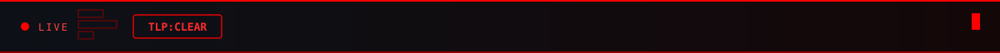
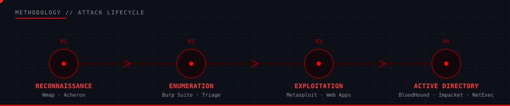

[README.md](https://github.com/user-attachments/files/32412199/README.md)
<!-- ══════════════════════════════════════════════════════════════════════ -->
<!--   Mahin (maheenrizwan23) · offensive security engagement profile       -->
<!--   required assets: ./assets/banner.svg · report-strip.svg ·           -->
<!--                     kill-chain.svg · divider.svg                       -->
<!-- ══════════════════════════════════════════════════════════════════════ -->




<div align="center">

<a href="https://maheenrizwan23.github.io/portfoilo/"></a>
<a href="https://www.linkedin.com/in/maheen-rizwan-7a2651363/"></a>
<a href="mailto:maheenrizwan23@email.com"></a>


</div>


## `§00` Executive Summary

| Field | Detail |
|---|---|
| Name |  Maheen Rizwan |
| Role | Cybersecurity Undergraduate & Offensive Security Practitioner |
| Institution | Abdul Wali Khan University Mardan (AWKUM), Pakistan |
| Council | Female Coordinator, Technology & Innovation Society (AWKUM Students Council) |
| Rank | TryHackMe — Global Top 5%, 100+ labs completed |


## `§01` Rules of Engagement

| Target Type | Engagement Type |
|---|---|
| Web applications | Penetration testing |
| Active Directory environments | Exploitation & lateral movement |
| Internal / external networks | Reconnaissance |
| General infrastructure | Vulnerability assessment |


## `§02` Methodology



<div align="center">

**Foundation —**


</div>


## `§03` Exhibits

<table width="100%">
<tr>
<td width="50%" valign="top">

**Exhibit A — Acheron**
`CLASSIFICATION: PUBLIC` · `STACK: PYTHON`

AI-powered web reconnaissance engine — automates target enumeration and surface mapping so the recon phase of an engagement starts from a triaged shortlist, not a blank scope.

</td>
<td width="50%" valign="top">

**Exhibit B — Host-Based FIM**
`CLASSIFICATION: PUBLIC` · `STACK: PYTHON, SQLITE`

Custom file integrity monitor — baselines watched paths, persists state to SQLite, and flags drift the moment a monitored file changes.

</td>
</tr>
<tr>
<td width="50%" valign="top">

**Exhibit C — Active Directory Lab**
`CLASSIFICATION: PUBLIC` · `STACK: BLOODHOUND, IMPACKET, NETEXEC`

Self-built domain lab covering initial access and lateral movement — enumeration, credential handling, and attack-path analysis end to end.

</td>
<td width="50%" valign="top">

**Exhibit D — PKI & Apache Hardening Lab**
`CLASSIFICATION: PUBLIC` · `STACK: APACHE, LINUX`

Certificate authority deployment paired with Apache configuration hardening and TLS enforcement — the defensive counterpart to the offense above.

</td>
</tr>
</table>


## `§04` Telemetry

<div align="center">


</div>


## `§05` Secure Channel

```console
mahin@awkum:~$ ssh -i contact.key mahin@secure

[+] key exchange complete
[+] channel encrypted — session established
[+] distribution: TLP:CLEAR — open to internships,
    red team collaboration, CTF squads, research

mahin@awkum:~$ _
```

<div align="center">

<a href="https://maheenrizwan23.github.io/portfoilo/"></a>
<a href="https://www.linkedin.com/in/maheen-rizwan-7a2651363/"></a>
<a href="mailto:maheenrizwan23@email.com"></a>

<br /><br />

### *"Understand the network baseline, exploit the visibility gaps, then script the fix."*

<sub>DOC // OFFENSIVE-SECURITY-PROFILE · TLP:CLEAR · DISTRIBUTION: UNLIMITED</sub>

</div>
